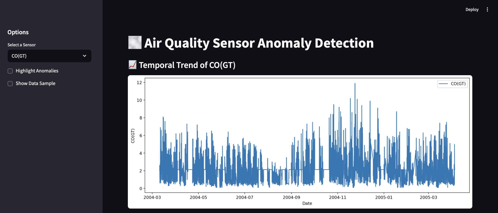
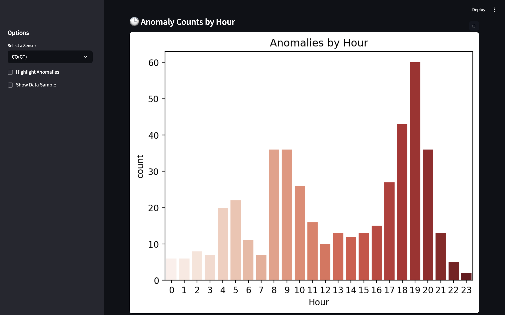
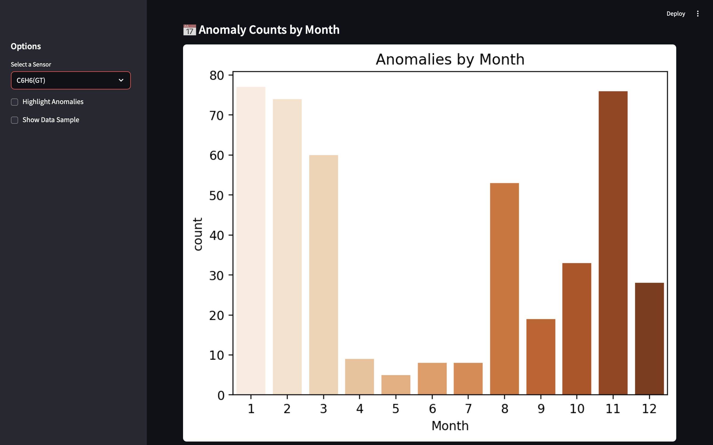
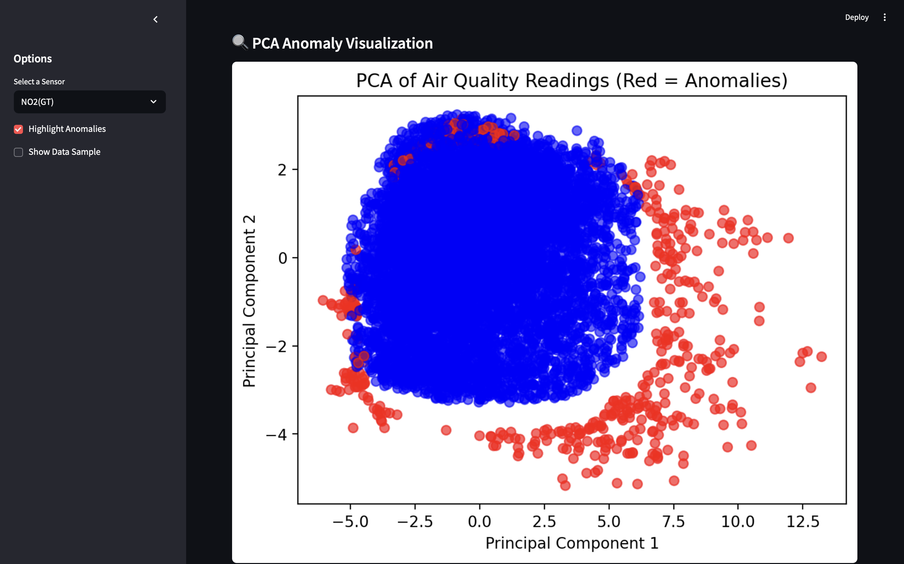

# Air Quality Anomaly Detection Dashboard

This project applies unsupervised machine learning techniques to detect anomalies in urban air quality sensor data.
The workflow includes data cleaning, feature engineering, exploratory data analysis (EDA), anomaly detection using Isolation Forest, and interactive visualization through a Streamlit dashboard.

---

## Project Structure
├── app/ # Streamlit application
│ └── app.py
├── data/ # Data files (original & processed)
│ ├── AirQualityUCI.csv
│ └── air_quality_preprocessed.csv
├── models/ # Model files (Ignored in git)
├── notebooks/ # Jupyter notebooks for EDA & modeling
│ └── eda_modeling.ipynb
├── screenshots/ # App screenshots
├── utils/ # Custom preprocessing utilities
│ └── preprocess.py
└── README.md


---

## Key Features

- **End-to-end data science workflow**: from cleaning to deployment
- **Feature engineering**: Time-based and sensor-derived features
- **EDA and insights**: Correlation heatmaps, time series plots, and anomaly interpretation
- **Unsupervised anomaly detection**: Isolation Forest and PCA visualization
- **Interactive dashboard**: Explore results live via Streamlit

---

## Getting Started

1. **Clone this repository:**
    ```bash
    git clone https://github.com/apurvavskr/air-quality-anomaly-detection.git
    cd air-quality-anomaly-detection
    ```
2. **(Recommended) Set up a virtual environment:**
    ```bash
    python -m venv .venv
    source .venv/bin/activate  # On Windows: .venv\Scripts\activate
    ```
3. **Install dependencies:**
    ```bash
    pip install -r requirements.txt
    ```
4. **Run the Streamlit app:**
    ```bash
    streamlit run app/app.py
    ```
5. **(Optional) Explore the notebook in JupyterLab or VS Code.**

---

## Example Visualizations

| Dashboard UI | Anomalies by Hour | Anomalies by Month | PCA Visualization |
|:------------:|:----------------:|:------------------:|:----------------:|
|  |  |  |  |


---

## Data Source

This project uses the [Air Quality Dataset](https://archive.ics.uci.edu/ml/datasets/air+quality) from the UCI Machine Learning Repository.

**Citation (APA):**  
Vito, S. (2008). Air Quality [Dataset]. UCI Machine Learning Repository. https://doi.org/10.24432/C59K5F.

---

## Acknowledgments

Some sections of this project were developed with the help of AI tools for code generation, error debugging, and documentation suggestions. All code was critically reviewed and customized to fit the project requirements.

---

## License

This project is for educational and demonstration purposes. Please review the original data license on the [UCI ML Repository](https://archive.ics.uci.edu/ml/machine-learning-databases/air-quality/).